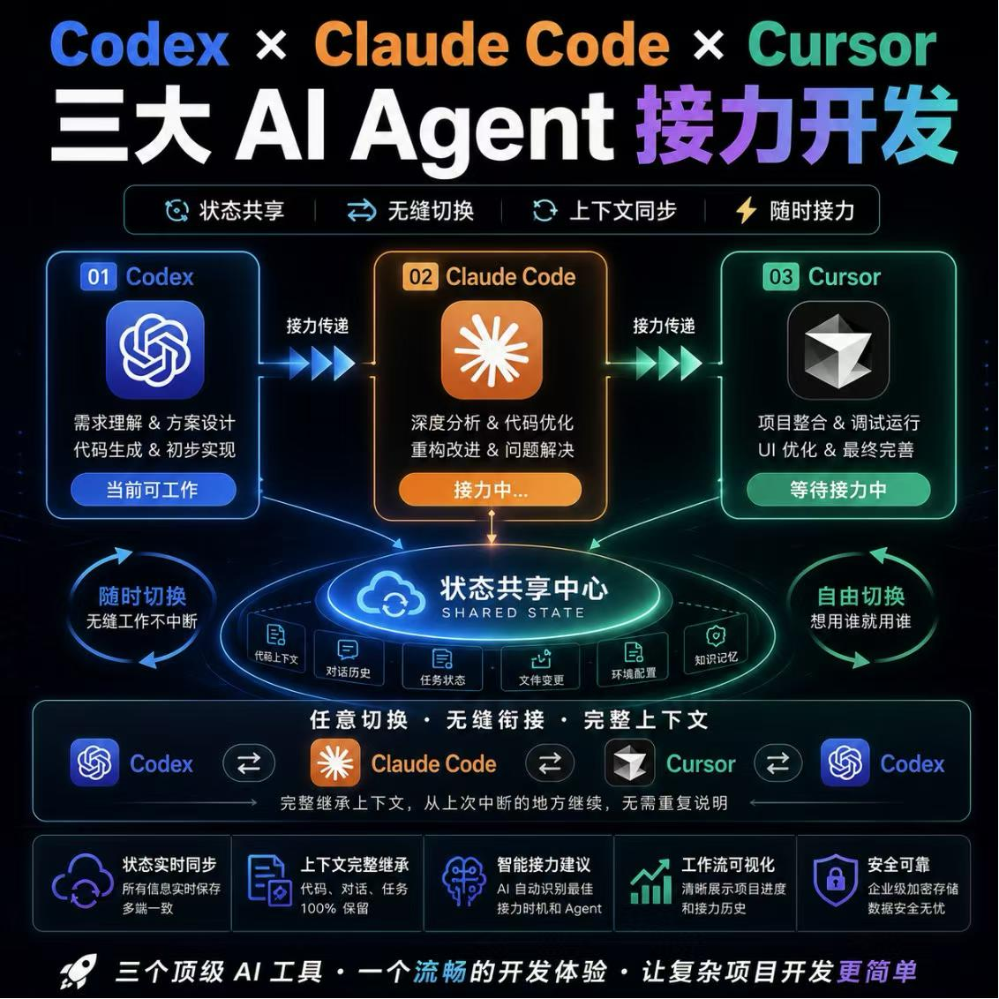
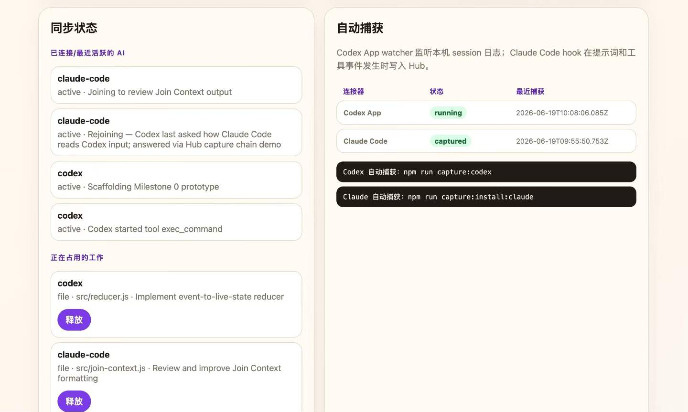
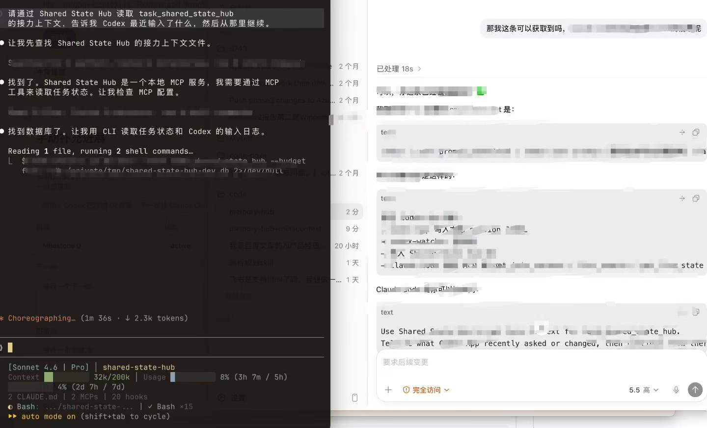
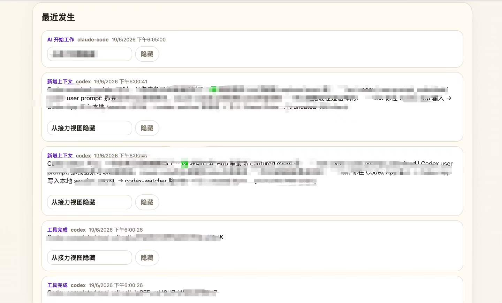

<p align="right"><strong>English</strong> | <a href="README.zh-CN.md">简体中文</a></p>

<div align="center">
  <h1>🔄 Shared State Hub</h1>
  <p><strong>Give Codex App, Claude Code, and other AI agents one shared handoff.</strong></p>
  <p>A local-first, auditable state relay for AI work: automatic capture, shared state, and on-demand handoff.</p>
  <p>
    
    
    
    
  </p>
</div>



Shared State Hub is **not** an agent launcher or a cloud chat archive. It is a local state relay: Codex App and Claude Code write to and read from the same append-only event log, Live State, and budgeted Join Context.

## 🌟 Why Shared State, Not Just Memory?

When everyone has multiple local agents, the ceiling on output is not the number of models they own. It is whether those agents can collaborate without losing the thread.

Most "memory frameworks" and "shared memory" products look backward: they retain preferences and summarize history, but struggle to let an agent join work that is happening right now.

Codex does not know what Claude Code just handled. Another agent does not know which files you attached, what the latest diff is, which decisions are already made, or what work is currently claimed. Every switch becomes a context-reconstruction exercise.

**Shared State Hub is not trying to help agents merely remember. It is trying to help them hand off.** It turns task state, context references, file changes, decisions, blockers, and next steps into a local, auditable, live shared-state layer. When one agent stops, another can continue from the right place.

> Credits exhausted? Use yours, use yours—pure bliss. ⚡
>
> *用完你的用你的，爽之！*

### 📌 Next

- 🧩 Support more agents and local tools
- 🕸️ Detect local agents, projects, and sessions, then recommend the right shared task
- 🔄 Let agents collaborate through verifiable state, not only long conversational memory

Repeat less context. Finish more real work.

```text
Codex App session logs      Claude Code hooks        MCP tools
          │                       │                    │
          └──────────────┬────────┴──────────────┬─────┘
                         ▼                       ▼
                  normalized Hub events   manual UI records
                         │
                         ▼
              SQLite append-only Event Log
                         │
                         ▼
              Live State + Join Context
                         │
        ┌────────────────┴────────────────┐
        ▼                                 ▼
   Web dashboard                       MCP read APIs
```

## Why

AI agents still work like isolated tabs. Codex may understand the current task, but Claude Code does not automatically know:

- what the user just asked in Codex;
- which files are already being edited;
- what decisions were made;
- what failed and should not be retried;
- what context should be handed off next.

Shared State Hub turns that into a local, inspectable state stream.

## ✨ What You Get

| Before | With Shared State Hub |
| --- | --- |
| Each Agent starts with fragmented context | One shared task state, decisions, blockers, and next steps |
| Switching from Codex to Claude means repeating yourself | Claude reads a compact Join Context and continues from the checkpoint |
| Session history is buried in product-specific logs | Important work becomes inspectable local events and derived views |
| Background capture is hard to trust | Local SQLite, redaction, summaries by default, and user-visible history |

## Features

- **Local-first**: stores events in local SQLite.
- **MCP server**: agents can read/write task state through MCP tools.
- **Codex App watcher**: best-effort capture from local Codex session JSONL logs.
- **Claude Code watcher**: best-effort capture from local Claude transcript JSONL logs.
- **Claude Code hooks**: project hooks capture prompts, tool events, and stop/session events.
- **Bilingual web UI**: Chinese by default, English with `?lang=en`.
- **Append-only control model**: corrections and redactions are events, not silent rewrites.
- **Privacy-conscious defaults**: capture mode defaults to summary, with secret redaction and truncation.

## 🎨 Showcase

### 1. Cross-agent handoff, not another chat silo

Codex App, Claude Code, and other MCP-capable tools can use the Hub as a shared checkpoint. The first release automatically captures Codex App and Claude Code; other MCP clients can join through the same task-state API.

### 2. See whether the local connectors are actually working



The dashboard shows task progress, connector health, recent activity, and the last capture time—without making users remember watcher commands.

### 3. Prove the handoff in a real workflow



When work moves from one Agent to another, the receiving Agent reads a compact Join Context instead of replaying an entire chat history.

### 4. Keep an auditable timeline



Every captured or explicit update becomes an append-only event. Users can inspect, correct, or hide information from future handoffs without silently rewriting history.

## Project Structure

```text
shared-state-hub/
├─ src/                  Core server, MCP tools, reducer, capture connectors
├─ scripts/              Local start/stop helpers
├─ fixtures/             Demo events
├─ docs/                 Architecture and setup docs
├─ examples/             Config templates
└─ docs/assets/          Product screenshots and diagrams
```

## Docs

- [Quickstart](docs/quickstart.md)
- [Architecture](docs/architecture.md)
- [Auto Capture](docs/auto-capture.md)
- [Local Storage](docs/local-storage.md)
- [Connector Setup](docs/connectors.md)
- [Publishing Notes](docs/publishing.md)

## Quick Start

Requirements:

- macOS (the first release uses a macOS background service)
- Node.js 20+
- `sqlite3`

Clone and install once:

```bash
git clone https://github.com/zkw15555506767-boop/shared-state-hub.git
cd shared-state-hub
npm install
npm run setup
```

The installer shows a preview first. After confirmation it creates backups, adds only Hub-owned MCP entries for Codex App and Claude Code, and registers a local background service. You do **not** need to keep a Terminal open.

Open the dashboard:

```text
http://127.0.0.1:43177/
```

From macOS Finder, you can instead double-click:

```text
SharedStateHub.command
```

After the npm package is published, the equivalent installation is:

```bash
npx shared-state-hub setup
```

## Use It in Codex App and Claude Code

After setup, use either agent normally. The local watchers automatically capture new prompts, session activity, and supported tool events into the Hub. You do **not** need to tell an agent to "record" ordinary work.

When you start a new task or continue work in either Codex App or Claude Code, send this one prompt:

```text
Before you begin, use Shared State Hub to read the current task and latest Join Context. Tell me where the previous agent stopped, then continue from there.
```

That single read gives the joining agent a compact, relevant checkpoint instead of the entire previous conversation. The same prompt works in both Codex App and Claude Code.

> Automatic capture writes activity **to** the Hub. The start prompt asks the next agent to safely read the latest shared checkpoint **from** the Hub.

## Daily Use

The Hub starts automatically after login. Codex App and Claude Code both write to and read from the same local task state. The normal dashboard only shows:

- what the current task is and what remains;
- whether Codex App and Claude Code are synchronizing;
- the latest shared activity.

Manual corrections, full event history, and diagnostics live in **设置与诊断 / Settings & Diagnostics**.

## Service Commands

```bash
npm run app:status
npm run app:open
npm run app:stop
npm run app:uninstall
```

`app:stop` retains data and agent configuration. `app:uninstall` removes only Hub-owned configuration entries and the background service; it keeps local data unless `--purge-data` is passed to the CLI.

## Developer Mode

For contributors only:

```bash
npm run dev:local
```

It starts temporary watchers and a demo UI, but no longer installs or changes any agent configuration.

## Web UI

Default Chinese UI:

```text
http://127.0.0.1:43177/tasks/task_shared_state_hub
```

English UI:

```text
http://127.0.0.1:43177/tasks/task_shared_state_hub?lang=en
```

Main sections:

- 当前任务 / Current Task
- 接力上下文 / Handoff Context
- 自动同步 / Automatic Sync
- 设置与诊断 / Settings & Diagnostics
- 自动捕获 / Auto Capture
- 手动补充进展 / Add Progress
- 快速记录 / Quick Records
- 最近发生 / Recent Activity

## How It Works

Shared State Hub normalizes multiple sources into one event stream:

| Source | Mechanism | What it captures |
| --- | --- | --- |
| Codex App | local JSONL watcher under `~/.codex/sessions` | user prompts, assistant status, tool calls |
| Claude Code | local JSONL watcher under `~/.claude/projects` | user prompts, assistant updates, tool results |
| Claude Code | project hooks in `.claude/settings.local.json` | user prompts, session start/end, tool calls |
| MCP clients | stdio MCP server | explicit task updates, decisions, claims, pitfalls |
| Web UI | local HTTP forms | manual progress, context, decisions, artifacts |

Those events are folded into:

- **Event Log**: append-only historical record.
- **Live State**: current task, agents, claims, warnings, next steps.
- **Join Context**: budgeted handoff summary for another AI to continue.

## MCP Tools

Start the MCP stdio server:

```bash
npm run mcp
```

Available tools:

```text
get_join_context
get_live_state
record_event
update_task
add_context
record_decision
record_pitfall
create_artifact_ref
redact_event
list_events
claim_work
release_claim
list_active_tasks
```

Generate connector instructions:

```bash
npm run connector:codex
npm run connector:claude
npm run connector:cursor
npm run connector:trae
```

## Auto Capture

Codex App watcher:

```bash
npm run capture:codex
```

Claude Code hook installer:

```bash
npm run capture:install:claude
```

Claude Code transcript watcher:

```bash
npm run capture:claude
```

Capture status:

```bash
curl http://127.0.0.1:43177/capture/status
```

Privacy notes:

- `HUB_CAPTURE_MODE=summary` is the default.
- Secret-like values such as API keys, tokens, and authorization headers are redacted.
- Captured text is truncated before being written to the Hub.
- Codex App capture is best-effort and depends on local session log shape.
- Claude Code watcher is best-effort and works even when project hooks are not loaded.

## HTTP API

```text
GET  /
GET  /health
GET  /capture/status
POST /events
GET  /events?task=<task_id>&includeRedacted=true
GET  /tasks/active
GET  /tasks/:taskId
POST /tasks/:taskId/update
GET  /tasks/:taskId/live-state
GET  /tasks/:taskId/join-context?budget=tiny|standard|deep
POST /tasks/:taskId/context
POST /tasks/:taskId/decision
POST /tasks/:taskId/pitfall
POST /tasks/:taskId/artifact
POST /claims
POST /claims/:claimId/release
POST /events/:eventId/redact
```

## Validation

Run the core test suite:

```bash
npm run http:fixture
npm run mcp:fixture
npm run agent:handoff
npm run capture:fixture
npm run connector:fixture
npm run check
```

Claude Code MCP health-check:

```bash
npm run claude:mcp-health
```

Codex App readiness check:

```bash
npm run codex:app-check
```

## Data Paths

Default product DB:

```text
~/.shared-state-hub/hub.db
```

Development DB used by npm scripts:

```text
/private/tmp/shared-state-hub-dev.db
```

Local generated files such as `.mcp.json`, `.claude/settings.local.json`, SQLite DB files, logs, and pid files are intentionally ignored by git.

## Current Status

Prototype / MVP.

The project currently proves:

```text
capture sources → normalized events → SQLite Event Log → Live State → Join Context → Web UI / MCP
```

Known limitations:

- Codex App capture is based on local session JSONL logs, not a stable official API.
- Claude Code hooks are project-local and require Claude Code to load project settings.
- The UI is local-only and not intended for remote hosting yet.
- No multi-user sync or cloud backend is included.
